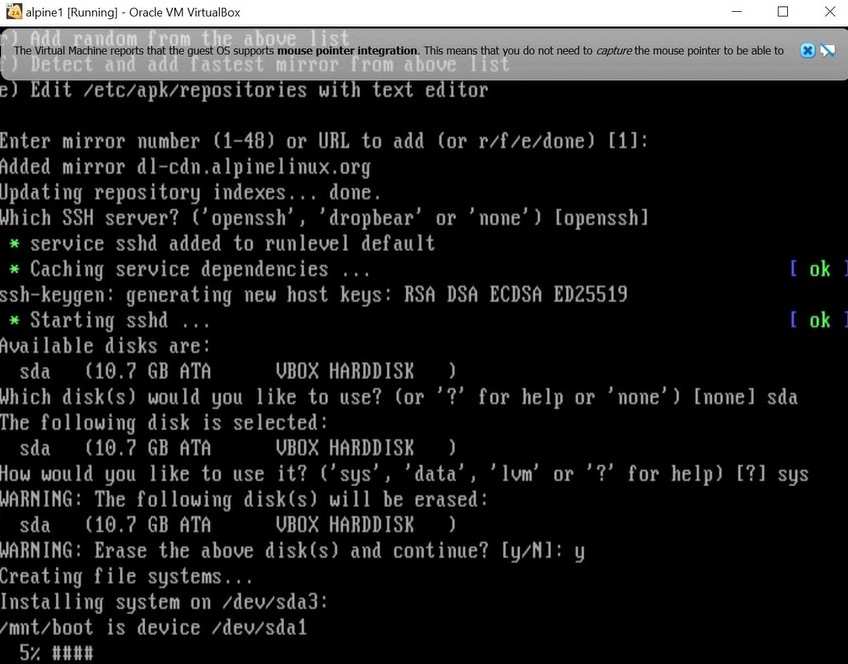
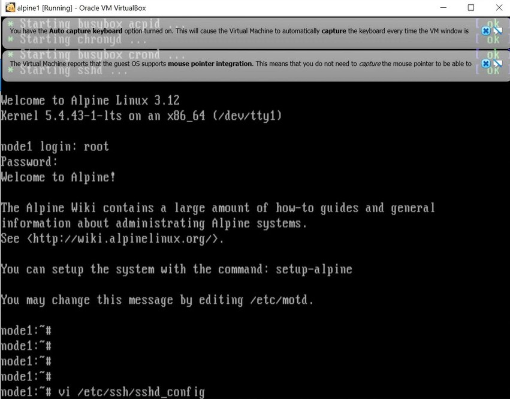
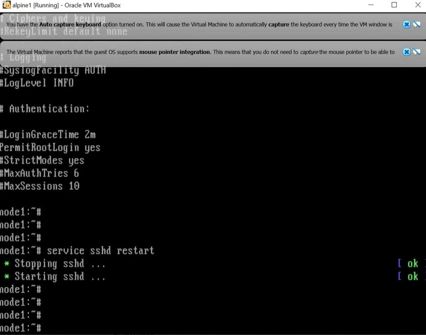
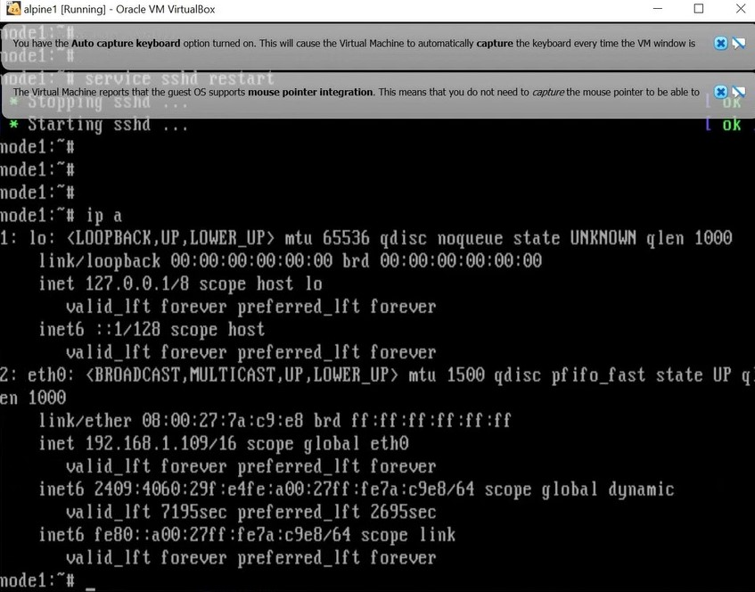

# Instalación de Docker usando Alpine Linux

Para las ocasiones en las que no podamos instalar Docker de forma habitual, podemos utilizar una máquina virtual de Alpine Linux. Para ello, es necesario seguir los siguientes pasos:

### Creación de la Máquina Virtual
---

1. Nos descargamos [Oracle VM VirtualBox](https://www.virtualbox.org/) y la versión que necesitemos de [Alpine Linux](https://alpinelinux.org/downloads/).

	
    
2. Instalamos *VirtualBox* y creamos la máquina virtual. Cuando la hayamos creado, iniciamos la instalación.

	
	

3. Entramos usando el localhost `root` e introducimos el comando `setup-alpine`. Posteriormente nos pedirá la distribución con la que está configurado nuestro teclado.

	

4. Una vez configurado el teclado, nos pide que introduzcamos el nombre del host y que seleccionemos varias opciones. Seleccionamos las opciones por defecto y nos pedirá introducir una nueva contraseña.

	

5. A continuación nos pide hacer más selecciones. Seleccionamos todas las opciones por defecto hasta que nos pida seleccionar el disco que queremos usar. Seleccionamos el disco y la manera en la que queremos usarlo. Confirmamos escribiendo `y` cuando nos lo pida.

	
	
	
Con esto ya hemos creado la máquina virtual. Para acabar, introducimos `poweroff` en la terminal para que se apague.

### Configuración en la Máquina Virtual
---

Antes de abrir **Alpine Linux**, debemos configurar la máquina virtual desde fuera. En las opciones de la máquina virtual en *VirtualBox* hay que habilitar un adaptador de red válido y modificar las órdenes de arranque para que solamente pueda arrancar desde el disco duro.

Ahora estamos listos para volver a encender la máquina virtual. Entramos usando `root` y la contraseña que le pusimos y a continuación escribimos en el terminal `vi /etc/ssh/sshd_cofig`.

Se nos abrirá un editor de texto donde tendremos que buscar `#PermitRootLogin prohibit-password`. Eliminamos la almohadilla, cambiamos `prohibit-password` por `yes` y guardamos y salimos.

El último paso es introducir `service sshd restart` en la terminal y, a continuación, `ip a`. Este último comando nos permitirá saber la dirección IP con la que deberemos conectar a docker.

### Instalación de Docker
---

Con la dirección IP obtenida, podemos dejar la máquina virtual en segundo plano. A partir de ahora trabajaremos en la máquina host. Debemos abrir cualquier terminal Bash que tengamos en nuestra disposición. Por ejemplo, podemos usar *Windows Powershell*. Introducimos en la terminal `ssh root@XXX.XXX.XXX.XXX` introduciendo a la derecha de @ tu dirección IP. Te pedirá confirmar la conexión y la contraseña para acceder. Cuando hayamos entrado, introducimos `vi /etc/apk/repositories`.

Se nos abrirá un documento de texto en el terminal. En todas las líneas debemos eliminar las almohadillas de todas las líneas, tal y como muestra la imagen. Desp´çues guardamos y salimos.

A continuación introducimos en el terminal `apk add docker` para que se instale. Para finalizar, introducimos `service docker start`.

### Prueba de funcionamiento: Hello World

Si hemos seguido bien los pasos, ya tenemos **Docker** instalado en nuestro ordenador. Para hacer la prueba, introducimos en la terminal `docker run hello-world`. Si todo ha salido correctamente, debería salir lo siguiente en pantalla:

